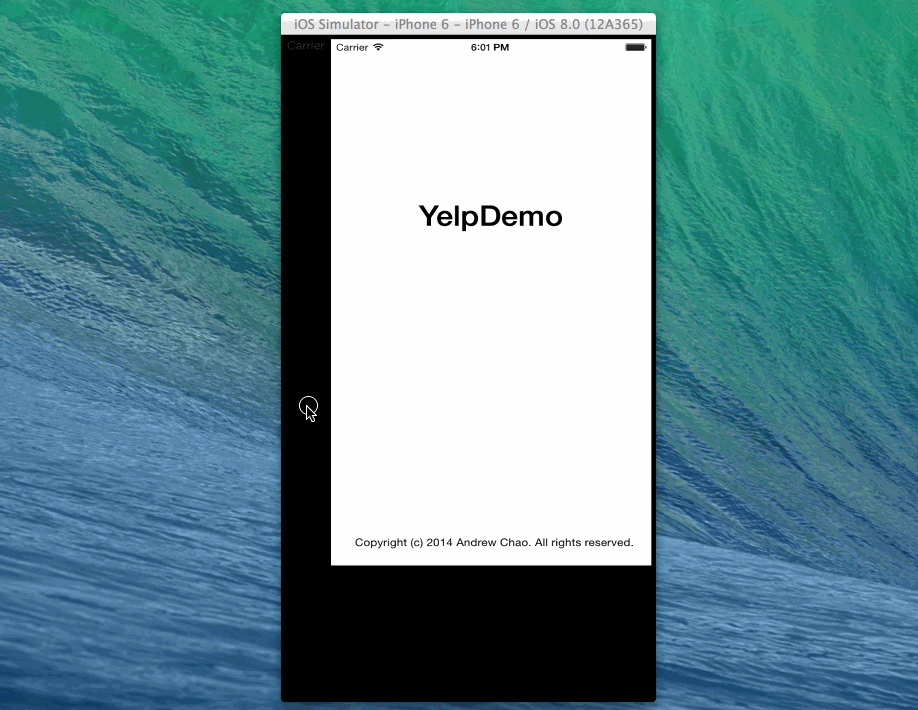

YelpDemo
========
Time to complete
~19 hours

 Assignment 2
 Required Tasks:
 * [x] Table rows should be dynamic height according to the content heigh
 * [x] Custom cells should have proper Auto Layout Constraints
 * [x] Search bar should be in the navigation bar (doesn't have to expand to show location like the real Yelp app does)
 * [x] The filters you should actually have are: category, sort (best match, distance, highest rated), radius (meters), deals (on/off)
 * [x] The filters table should be organized into sections as in the mock
 * [x] You can use the default UISwitch  for on/off states. 
 * [x] Radius Filter should expand as in the real Yelp app
 * [x] Categories should show a subset of the full list with a "See All" row to expand. Category list is here: http://www.yelp.com/developers/documentation/category_list (Links to an external site.)
 * [x] Clicking on the "Search" button should dismiss the filters page and trigger the search w/ the new filter settings.

 Optional
 * [ ] Infinite Scroll
 * [ ] Implement map view of restaurant results
 * [ ] Custom switch
 * [ ] Restaurant details page

Walkthrough of all user stories:

